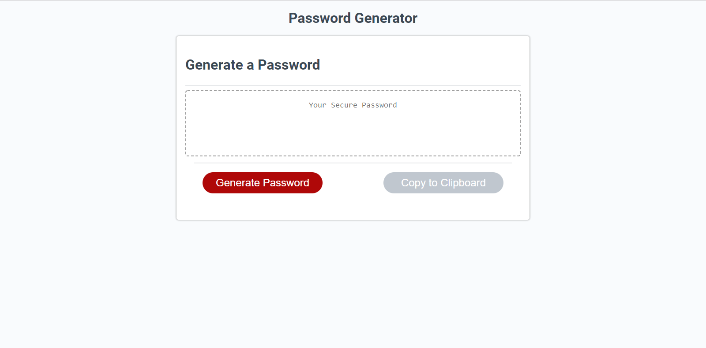

# Password Generator

Assignment 3 for University of Toronto coding bootcamp.

Live Demo: https://andydurette.github.io/password-generator/

This assignment focused on generating a random password from a criteria of data.
I handled this by using using prompts upon clicking the generate password button.
I also handled potential errors using recursion to lead back to the same prompt if they gave insufficient data.

